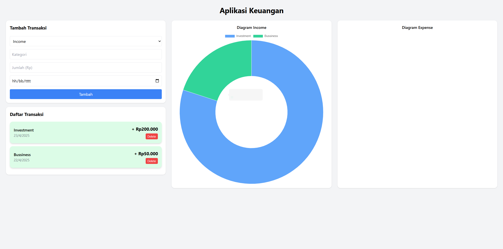

# 💰 Personal Income & Expense Tracker

A full-stack web application to track your personal income and expenses, featuring pie charts for visual breakdowns and a clean, responsive UI built with React and Tailwind CSS. Backend is powered by Express.js with a PostgreSQL database.

---

## 🚀 Features

- Add income and expense transactions with category, amount, and date
- View all transactions in a simple list
- Visual summary using pie charts (income and expense)
- Delete individual transactions
- No authentication system (for simplicity)

---

## 🛠️ Tech Stack

**Frontend:**
- React.js
- Tailwind CSS
- Chart.js (via react-chartjs-2)

**Backend:**
- Node.js + Express.js
- Sequelize ORM
- PostgreSQL

---

## ⚙️ Installation Guide

### Prerequisites
- Node.js (preferably via [nvm](https://github.com/nvm-sh/nvm))
- PostgreSQL
- npm or yarn

---

### 1. Clone the Repository

```bash
git clone https://github.com/zulfaiflakhul/expense-tracking.git
cd expense-tracker-app
```
### 2. Back End Setup

```bash
cd backend
npm install
```

Create PostgreSQL database manually, then configure connection in .env:

```bash
DB_NAME=your_db
DB_USER=your_user
DB_PASSWORD=your_pass
DB_HOST=localhost
```

Run

```bash
npx sequelize db:migrate
npm start
```

### 3. Front End Setup

```bash
cd ../client
npm install
```

Make sure Tailwind CSS is initialized:

```bash
npx tailwindcss init -p
```

Then run

```bash
npm run dev
```

## 📊 Screens


## 🕒 Development Timeline

This project was developed in approximately **3 hours**, from **April 22, 11:00 PM** to **April 23, 02:00 AM**, including backend API setup, React UI design, Tailwind CSS styling, and chart integration.

## 👨‍💻 Author
Built with ❤️ by Zulfa Iflakhul Fadilla